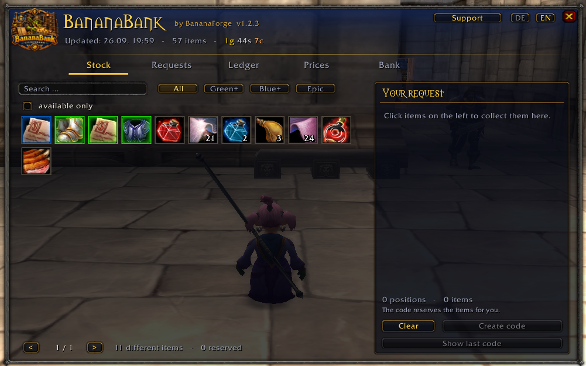
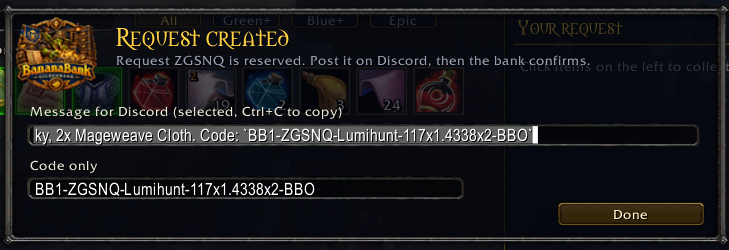
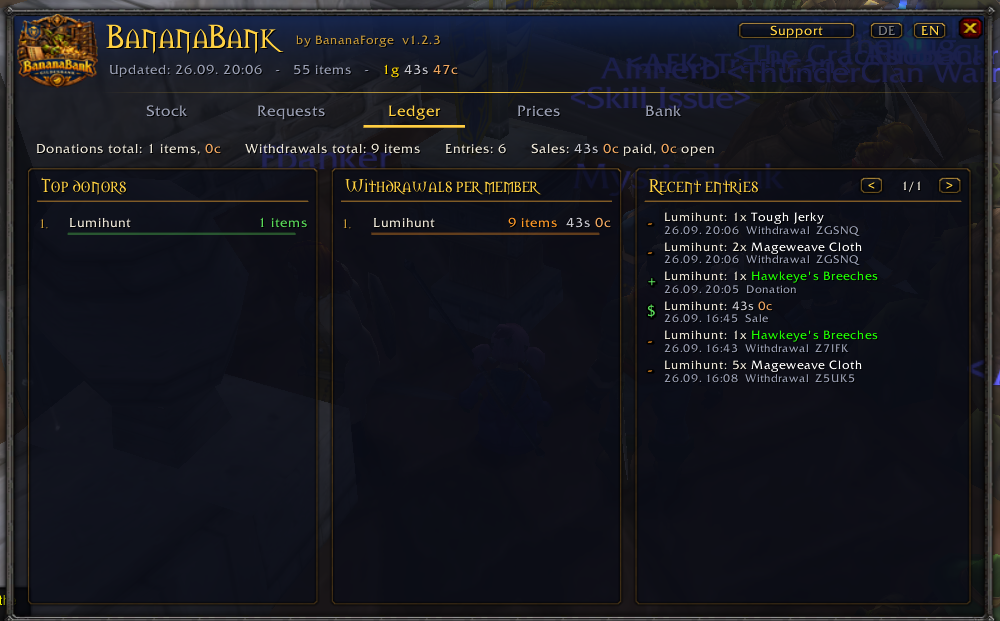
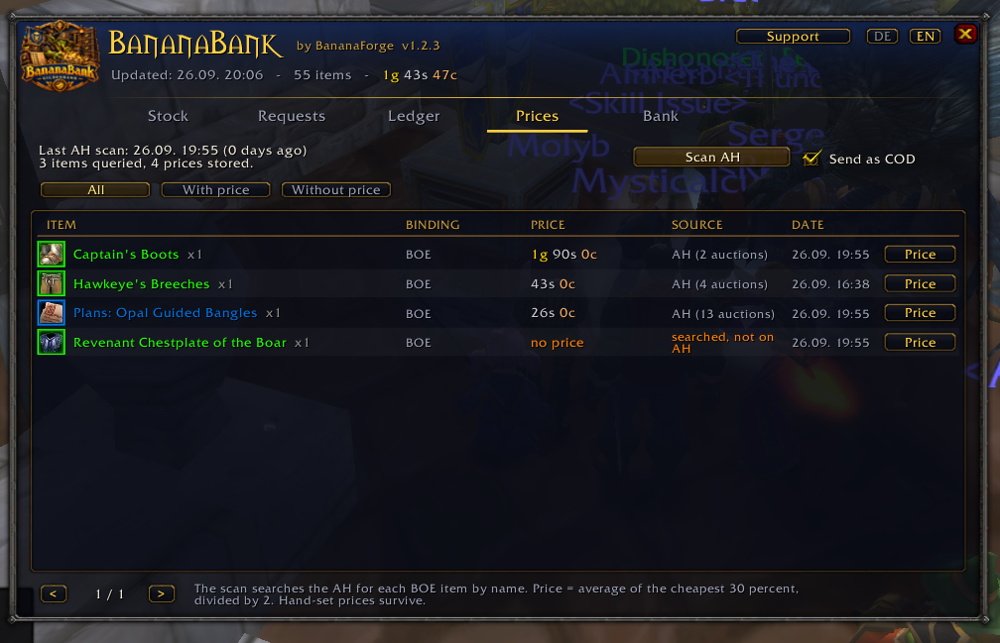

# 🍌 BananaBank

**Guild bank for Vanilla WoW 1.12 (OctoWoW): share your stock, request items, track donations.**

  

Vanilla WoW has no guild bank, so nobody knows what the bank character holds or who donated what. BananaBank fixes that: the bank character shares its stock over the guild channel, members request items with a code, the bank mails them out, and every donation and withdrawal lands in a ledger. Built for the guild **Banana Republic**. Lua 5.0, no libraries.

## Requirement: the guild rank `Gildenbank`

BananaBank only works in a guild that has a guild rank called **`Gildenbank`** (`guildbank` works as well, case does not matter). Only characters holding that rank count as a verified bank.

- The rank names are fixed in the addon. There is no setting for another rank.
- Without a character holding the rank, the addon is locked and the window only shows a notice.
- Every member checks the rank in their own guild roster, so editing files does not get around it.

## Features

- **Stock for everyone:** the bank character records bags and bank on every bank visit. Grid with quality borders, search and filters. Soulbound items are hidden.
- **Requests by code:** fill the cart, create a code, post it on Discord. The code reserves the items right away. Status: `Open → Confirmed → Sent`. Open requests expire after 7 days.
- **Mail and trade:** *Fetch items* prepares exact stacks, the send helper mails them (several attachments if the client allows). A trade with a requester counts towards their confirmed request.
- **Prices and COD:** targeted auction house scan for BOE items (average of the cheapest 30 %, divided by 2). Prices can be set by hand. Mail goes out cash on delivery if you want.
- **Ledger:** donations by mail and trade, withdrawals, COD sales and returned mail are booked automatically. Transfers between bank characters are not donations.
- **Guild quests:** officers post farm quests ("60 Runecloth for bags", several items per quest, optional deadline). Progress is counted from the ledger whenever the bank character accepts a delivery by mail or trade. Top helpers per quest, a permanent points ranking, a tracker window and a toast when a quest is complete. Delivered items can be locked for requests.
- German and English, minimap button, `/bb status` diagnostics.

## Screenshots

| Stock | Request code | Ledger | Prices |
|---|---|---|---|
|  |  |  |  |

## Installation

1. Download the [latest release](https://github.com/BananaForge/BananaBank/releases) and put the `BananaBank` folder into `Interface/AddOns/`.
2. Enable it on the character screen and open the window with `/bb`.

When updating, delete the old folder first, otherwise an old `BananaBank.toc` can stop the new files from loading. **Every member needs the addon.**

## Usage

**Setup (once):** the guild master creates the rank `Gildenbank` and gives it to the bank character. On that character run `/bb setbank`, then open the bank.

**Members:** open `/bb`, click items on the **Stock** tab (click `+1`, Shift+click all, right-click `-1`), hit **Create code**, copy the message to Discord, follow the status on **Requests**.

**Bank character:** on the **Bank** tab paste the code, **Check**, then **Confirm** or **Reject**. At the bank hit **Fetch items**, at the mailbox **Send mail**.

| Command | Effect |
|---|---|
| `/bb` | Open or close the window |
| `/bb status` | Diagnostics: why is nothing shown? |
| `/bb setbank` / `removebank` | Set or remove the bank role for this character |
| `/bb scan` / `sync` | Record and send stock / sync with the guild |
| `/bb prices` / `ahscan` | Prices tab / fetch prices at the auction house |
| `/bb quests` / `tracker` | Open the Guild quests tab / show or hide the quest tracker |
| `/bb unhide` | Show hidden items again (Alt+click hides an item) |
| `/bb lang de\|en\|auto` | Language |
| `/bb minimap` / `support` / `debug` | Minimap button / donation window / debug output |

A second bank character works the same way: any character with the rank can run `/bb setbank`. Stocks are added up, and a request can be filled from both.

## Guild quests

- **Who may create and manage quests:** guild master (rank 1), the `Gildenbank` rank and the officers (ranks 2 and 3). Everybody else sees quests and progress.
- **Creating:** *Guild quests* tab, **+ New quest**. Add items with Shift-click on an item in your bags (or Ctrl-click in the stock), set amounts, optional deadline in days, and whether delivered items are locked for requests.
- **Delivering:** by mail or trade to a bank character. A delivery counts when the bank accepts it. Overflow beyond the need is booked as a normal donation, older quests are filled first.
- **Points:** your share of each quest, added up (a whole quest alone = 10 points). Ranking is permanent, with a monthly view.
- **Tracker:** *Track* on a quest puts it into a small movable window. `/bb tracker` hides or shows it.
- Only deliveries booked by a verified bank character count, other clients discard anything else.
- Quest managers' activity is kept in a hidden local log for officers.

## Technical notes

- Client 1.12.1 (Interface 11200), saved variables `BananaBankDB`, addon prefix `BBNK` on the guild channel.
- Analytics: once per login the addon reports its name and version invisibly to the guild dashboard BananaGuild (guild addon channel, prefix `BGLD`, via `BananaPresence.lua`). Nothing is shown in chat.
- Throttled send queue (0.3 s), messages under 250 bytes. Synchronised: stock, ledger, requests, prices, guild quests.
- Code format: `BB1-<ID>-<Player>-<ItemID>x<Amount>.<...>-<Checksum>` (Base36, DJB2 checksum).
- Limits: stock can only be read while the bank is open (the last scan is used in between). Other mail addons such as TurtleMail can interfere with attachments. Someone editing their own files can only fool themselves: other clients discard the data, and mail only goes to the name in the code.

## Contributing

Pull requests welcome, tested in-game on a 1.12 client. Lua 5.0 rules: no `#`, `%`, `string.match`, `select` or `...`; script handlers read `this`, `event` and `arg1..9` as globals; no `SetSize` or `SetColorTexture`; German texts in `Locale.lua` use umlauts and `ss` instead of `ß`.

## Changelog

- **1.4.0:** guild quests (several items, optional deadline, top helpers, points ranking, tracker, toast, item reservation, hidden manager log). Ledger entries that advance a quest are only accepted from verified bank characters.
- **1.3.0:** fixed bank rank `Gildenbank` / `guildbank` as a hard requirement (lock screen, no rank setting), trades count towards confirmed requests, COD price frozen per stack, returned mail reduces withdrawals, bank-to-bank transfers are no longer donations.
- **1.2.x:** AH scan per item, price dialog, COD, rank sync (removed in 1.3.0).
- **1.0.0:** first release.

## Credits and license

Part of **BananaForge** (with [BananaRepublicProfs](https://github.com/BananaForge/BananaRepublicProfs) and [BananaLootline](https://github.com/BananaForge/BananaLootline)). Development: **Lumihunt**, guild Banana Republic. Free forever; if you want to support it, send in-game mail to Lumihunt. MIT, see [LICENSE](LICENSE).
