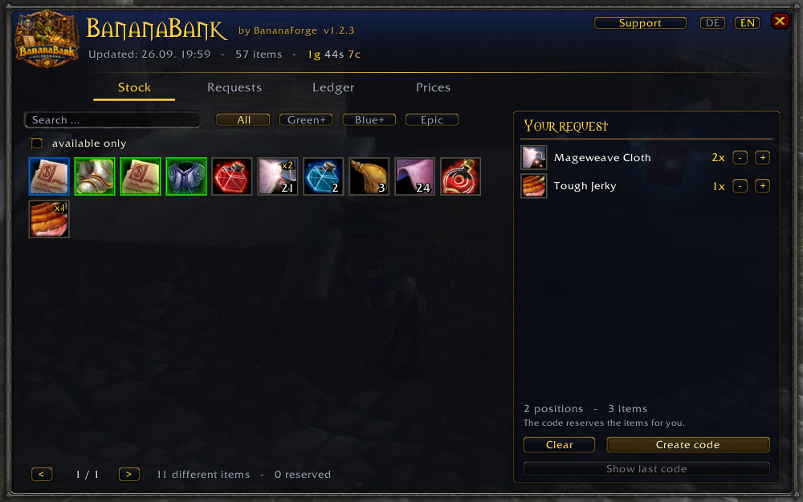
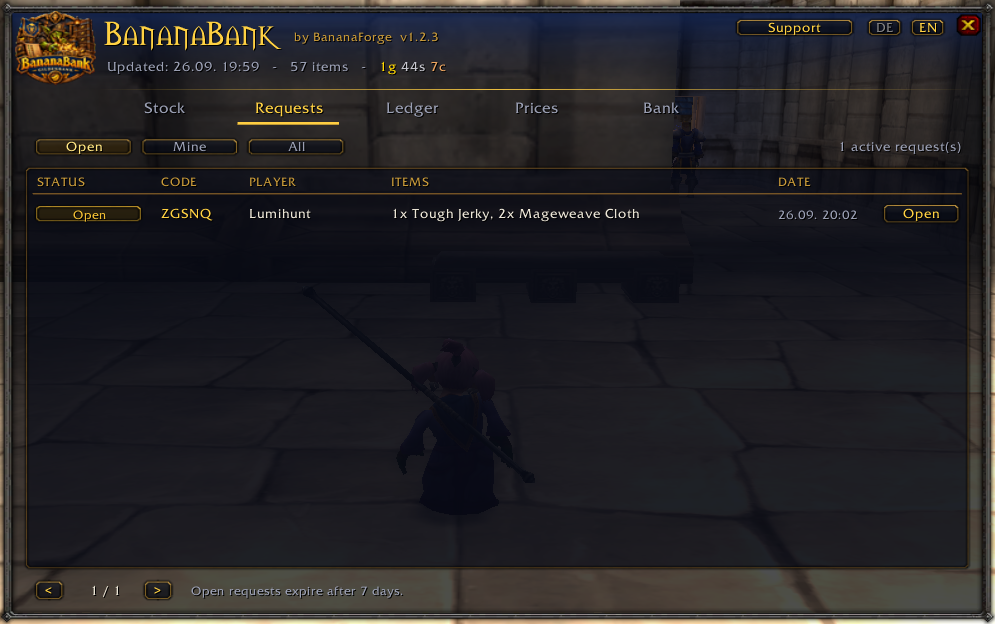
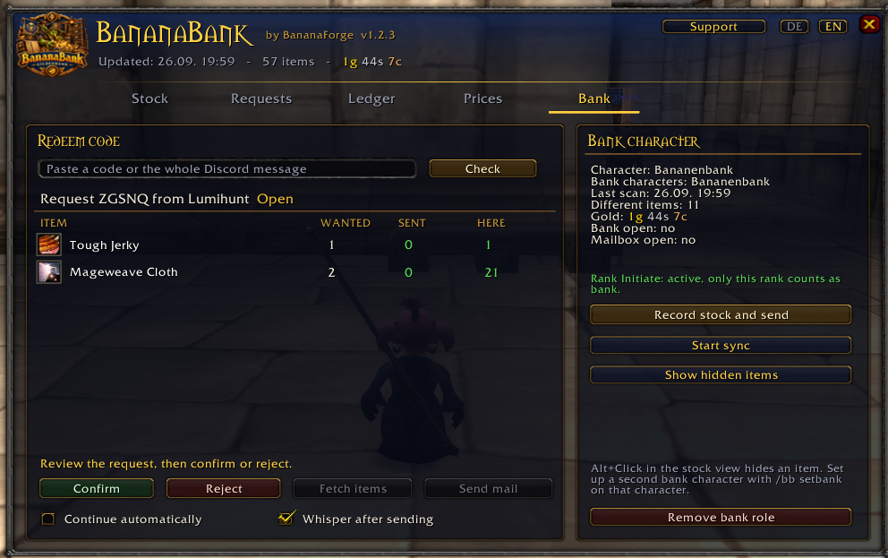
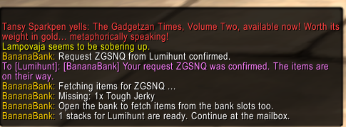
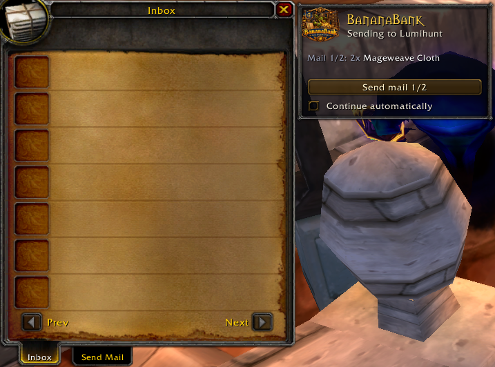
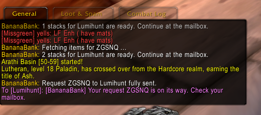

# 🍌 BananaBank

**The guild bank for Vanilla WoW 1.12 — share your stock, request items, track donations.**

[](https://github.com/BananaForge/BananaBank/releases)
[](https://github.com/BananaForge/BananaBank)
[](https://github.com/BananaForge/BananaBank)
[](LICENSE)
[](https://github.com/BananaForge)

---

## 📖 Overview

Vanilla WoW has no guild bank. Most guilds work around it with a dedicated bank account, and that is where the trouble starts: nobody knows what is in there. Whoever needs something asks in guild chat, waits for someone with access, and in the end nobody remembers who donated what.

**BananaBank fixes that.** The bank character records its stock whenever it opens the bank and shares it over the guild channel. Every member sees that stock in their own window, picks items and generates a code. The code travels to the bank through Discord, gets redeemed there, and the addon pulls the items out of the bank slots and mails them. Every withdrawal and every donation lands in the ledger automatically.

Built for the guild **Banana Republic** on **OctoWoW**, runs on any 1.12 client.

---

## ✨ Features

### 📦 Stock everyone can see
- The bank character records bags and bank slots automatically on every bank visit
- Distributed over the guild channel, no external service involved
- Grid with quality borders, search and filters by item quality
- Soulbound items never show up — they could not be mailed anyway
- Stock stays visible even while the bank character is offline

### 🎫 Requests via Discord code
- Click items, fill the cart, hit **Create code**
- The code reserves those items for you right away — no race against other members
- Ready-made Discord message to copy, with a checksum against typos and tampering
- The bank character pastes the code or the whole Discord message, then confirms or rejects
- Status travels through the guild: `Open → Confirmed → Sent`
- Open requests expire after 7 days and release the reservation

### 📬 Mail delivery
- **Fetch items** puts exact stacks into the bags, stack splitting included
- Detects how many attachments the client allows and packs accordingly
- Send helper next to the mailbox, optional auto-continue
- Whisper to the recipient once the mail is out

### 💰 Guild prices and COD
- Targeted AH search for every BOE item in stock, no paging through the whole auction house
- Price = average of the cheapest 30 percent of unit prices, divided by 2
- Hand-set prices with separate fields for gold, silver and copper
- Hand-set prices survive every scan and can be reset with one button
- Mail optionally goes out cash on delivery, income lands in the ledger as **Sale**

### 📊 Donation and withdrawal ledger
- Donations by mail and by trade are booked automatically
- Top donors, withdrawals per member, recent entries
- Returned mail and gold tracked separately
- Auction house mail never counts as a donation

### 🔒 Rank gate against abuse
- The bank role hangs on a **guild rank**, not on a list inside the addon
- Ranks are handed out by the server, not the addon — so editing the files does not get you past it
- Every member verifies the rank independently before accepting stock data
- The rank name is distributed to the guild by the guild master
- If a bank character loses the rank, its stock disappears for everyone within seconds

### 🎨 And the rest
- German and English, switchable inside the window
- Minimap button, draggable around the minimap
- Donation window with a mailbox shortcut
- `/bb status` diagnostics that tell you what is missing

---

## 📥 Installation

### Manual

1. Download the [latest release](https://github.com/BananaForge/BananaBank/releases)
2. Extract the ZIP
3. Copy the `BananaBank` folder into `Interface/AddOns/`
4. Start WoW and enable it under **AddOns** on the character screen
5. Open the window with `/bb`

> **When updating, delete the old folder instead of overwriting it.** If an old `BananaBank.toc` stays behind, the game will not load the new files. The addon tells you on login when something is missing.

### Via Git

```bash
cd "World of Warcraft/Interface/AddOns"
git clone https://github.com/BananaForge/BananaBank.git
```

**Every member needs the addon**, otherwise they cannot see the stock.

---

## 🚀 Usage

### First-time setup

On the bank character, once:

```
/bb setbank
```

Then walk to a banker and open the bank. The stock gets recorded and sent to the guild.

### For members

| Step | Action |
|---|---|
| 1 | `/bb` or the minimap button, **Stock** tab |
| 2 | Click items: click `+1`, Shift+click all, right-click `-1` |
| 3 | **Create code** — the items are reserved for you from now on |
| 4 | Copy the highlighted message with `Ctrl+C`, post it on Discord |
| 5 | Follow the status on the **Requests** tab |

### For the bank character

| Step | Action |
|---|---|
| 1 | **Bank** tab, paste the code or the whole Discord message, hit **Check** |
| 2 | **Confirm** or **Reject** |
| 3 | At the bank, hit **Fetch items** — the addon puts exact stacks into your bags |
| 4 | At the mailbox, hit **Send mail** |

### Commands

| Command | Effect |
|---|---|
| `/bb` | Open and close the window |
| `/bb status` | Shows why no stock is there |
| `/bb setbank` / `/bb removebank` | Set or remove the bank role for this character |
| `/bb scan` | Record stock and send it |
| `/bb sync` | Trigger a sync with the guild |
| `/bb prices` | Open the Prices tab |
| `/bb ahscan` | Fetch prices from the auction house |
| `/bb bankrank <name>` | Set the guild rank that allows bank characters |
| `/bb unhide` | Show hidden items again |
| `/bb lang de\|en\|auto` | Language |
| `/bb minimap` | Toggle the minimap button |
| `/bb support` | Donation window |
| `/bb debug` | Debug output |

---

## 🔧 Advanced

### Who may be a bank character

So that not every member can turn themselves into a bank character, the role hangs on a guild rank. **Default: `Initiate`** — every client adopts that value automatically as long as nobody changes it. No guild master is needed to get started.

For permanent use, a dedicated rank is worth it:

1. Create a rank in the guild window, for example `Gildenbank`
2. Put the bank character into that rank
3. Guild master: `/bb bankrank Gildenbank,Initiate`
4. `/bb status` shows who has already picked up the setting
5. Once nobody differs any more: `/bb bankrank Gildenbank`

Several rank names are allowed, separated by commas. That way the switch needs no cutoff date and nobody loses their stock view in between.

### Prices and COD

```
/bb ahscan     (at the auctioneer, auction house open)
```

The scan searches specifically for every BOE item in stock. With 14 items that takes seconds instead of minutes.

- If the scan finds nothing, the source column says so together with the date
- Hand-set prices go through the **Price** button on the **Prices** tab
- Mail sets the COD amount per letter, and can be switched off

### Second bank character

Run `/bb setbank` on another character holding the matching rank. Stocks are added up and the tooltip shows the amount per bank character. A request can be partly sent from character A and finished from character B.

### Hiding items

`Alt+click` in the stock view hides an item for everyone, useful for the bank character's own consumables. `/bb unhide` brings everything back.

---

## ⚙️ Technical Details

| | |
|---|---|
| **Client** | Vanilla 1.12.1, Interface 11200 |
| **Language** | Lua 5.0, no libraries, no dependencies |
| **Size** | 9 files, roughly 5,200 lines |
| **Prefix** | `BBNK` on the guild channel |
| **Storage** | `BananaBankDB`, per account |

### Network protocol

Throttled send queue with 0.3 seconds between messages, payloads under 250 bytes, UTF-8 safe chunking. Five kinds of data are synchronised:

| Kind | Content |
|---|---|
| `S` | Stock per bank character |
| `L` | Ledger entries |
| `Q` | Requests and reservations |
| `P` | Guild prices |
| `R` | Bank rank name, guild master only |

On login the clients compare their states. Whoever holds something newer answers after a random delay; if someone else answers first, the own reply is dropped. That keeps the channel quiet even when ten people log in at once.

### Code format

```
BB1-<ID>-<Player>-<ItemID>x<Amount>.<...>-<Checksum>
```

Base36 with a DJB2 checksum. No characters that Discord would reformat or that would break WoW chat. The parser also finds the code in the middle of a longer message.

### Known limits

- No internet access from inside the game — the code is copied by hand
- Bank slots are only readable while the bank is open, in between the last scan applies
- Mailed donations carry no item ID in 1.12, so the ledger stores name and quality
- Other mail addons such as TurtleMail can interfere with attaching items
- Anyone editing their own copy of the files can show themselves made-up numbers. Other clients discard their data, and mail only ever goes to the name inside the code. No addon can provide absolute security in Vanilla.

---

## 📸 Screenshots

### Step 1 — Stock tab: browse the guild bank


The bank character's entire stock at a glance. Quality borders (green, blue, epic), item counts, search field and quality filters. Click any item to add it to your request.

---

### Step 2 — Stock tab: items added to the cart



Two items in the cart: 2× Mageweave Cloth and 1× Tough Jerky. The code reserves them the moment you hit **Create code** — no race against other members.

---

### Step 3 — Request created: Discord message ready


Code `BB1-ZGSNQ-Lumihunt-…` generated. The full Discord message is pre-written and selected — one Ctrl+C to copy. The code is also shown on its own for quick paste.

---

### Step 4 — Requests tab: open request



After posting on Discord the request shows up as **Open** in the Requests tab. Status travels through the guild: Open → Confirmed → Sent.

---

### Step 5 — Bank tab: redeem the code



Bank character pastes the code (or the whole Discord message) and hits **Check**. The addon shows exactly what was requested, how many are in stock, and how many have already been sent.

---

### Step 6 — Bank tab: confirmed, fetch items


After **Confirm** the status turns green. Chat shows the whisper sent to the requester. Now **Fetch items** is active — the addon pulls exact stacks from the bank slots into the bags.

---

### Step 7 — Chat: confirmation whisper



The requester gets an instant whisper. The bank character's chat shows the fetch progress: items found in bags, a note about what still needs to come from the bank.

---

### Step 8 — Mail helper: send 1 of 2



At the mailbox the send helper appears. Mail goes out in batches — the addon tracks how many attachments the client supports and packs accordingly.

---

### Step 9 — Chat: request fully sent



Both mails out, whisper sent: "Your request ZGSNQ is on its way. Check your mailbox." The request closes automatically.

---

### Step 10 — Ledger tab: donations and withdrawals


Top donors on the left, withdrawals per member in the middle, recent entries on the right. Donations, withdrawals, and COD sales are all tracked automatically.

---

### Step 11 — Prices tab: AH prices and COD


Every BOE item in stock gets a guild price from the AH scan (average of cheapest 30%, divided by 2). Items not on the AH are marked "searched, not on AH". **Send as COD** charges the recipient on delivery.

---

### Step 12 — Prices tab: scan in progress

*(see screenshot 11 for the finished result)*

---

## 🤝 Contributing

Pull requests welcome. Please run the tests before submitting:

```bash
lua50 tools/test_all.lua
```

`tools/wowstub.lua` reimplements the 1.12 API and allows **only methods that actually exist in 1.12**. A stray `SetSize` or `SetColorTexture` fails immediately instead of in-game.

### Coding rules for Vanilla 1.12

- Lua 5.0: no `#`, no `%` operator, no `string.match`, no `gmatch`, no `select`, no `...` arguments
- Script handlers receive no parameters: `this`, `event`, `arg1..arg9` are globals
- No `SetSize`, no `SetColorTexture`, no `RegisterAddonMessagePrefix`
- Addon messages under 250 bytes, no `|` characters, sent sequentially
- German strings in `Locale.lua` use real umlauts and `ss` instead of `ß`

---

## 📝 Changelog

### 1.2.3
- `/bb status` shows which members have already adopted the rank setting

### 1.2.2
- Price dialog with separate fields for gold, silver and copper
- Money amounts everywhere in coin colours, leading zeroes dropped
- Items the scan could not find are listed as "searched, not on AH" with a date

### 1.2.1
- Default rank `Initiate` for the test phase, no guild master required
- Several rank names via comma for a switch without a cutoff date

### 1.2.0
- AH scan searches per item instead of paging through the whole auction house
- The rank name is distributed to the guild by the guild master
- Blocked bank characters are dropped from already stored stock as well

### 1.1.x
- Mail sending in two steps, detects clients with multiple attachment slots
- Guild prices and cash on delivery
- Whisper on confirm and reject
- Logo re-cut and scaled to fit
- `/bb status` as a diagnostics command

### 1.0.0
- First release: stock, requests via code, mail delivery, donation ledger

---

## ❓ Support

**The window is empty although there are items in the bank.**
Type `/bb status`. The last line says what is missing — usually the bank character has to open the bank once.

**A member cannot see the stock.**
Do they have the addon? Is it the same version? `/bb sync` triggers a sync.

**Mail goes out without the attachment.**
Another mail addon is in the way. Disable it for the bank character and `/reload`.

**A BOE item has no price.**
It is not on the auction house right now. Set it by hand on the **Prices** tab.

**Can anyone make themselves a bank character?**
Only characters holding the configured guild rank. `/bb status` shows who holds it.

---

## 🍌 BananaForge

BananaBank is part of **BananaForge**, the addon forge of the guild Banana Republic:

| Addon | Purpose |
|---|---|
| [BananaRepublicProfs](https://github.com/BananaForge/BananaRepublicProfs) | Guild professions and recipes, over 1,500 recipes across 7 professions |
| [BananaLootline](https://github.com/BananaForge/BananaLootline) | Gear and lootline planner |
| **BananaBank** | Guild bank |

---

## 💛 Support the project

BananaBank is free and stays free. If you want to support development, send in-game mail to **Lumihunt**. Inside the addon the **Support** button takes you straight to the mailbox.

---

## 📄 License

MIT — see [LICENSE](LICENSE).

---

## 🙏 Credits

- Development: **Lumihunt**, guild Banana Republic
- Thanks to everyone in the guild who tested this and put up with broken mail
- Thanks to the OctoWoW community
